

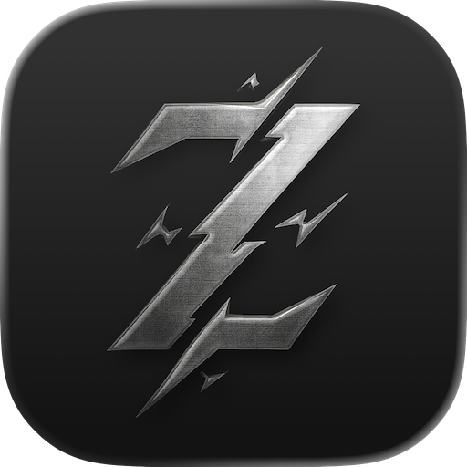

# Zytor

### The All-in-One Media Downloader

### One App. Any Link. No Ads. No Tracking. Full Privacy. Unlimited Possibilities

#### Video, Audio, Image, Playlist — Everything

Stop juggling multiple apps, shady websites, or converters.  
**Zytor downloads *everything* from almost anywhere.**

 

## Screenshots

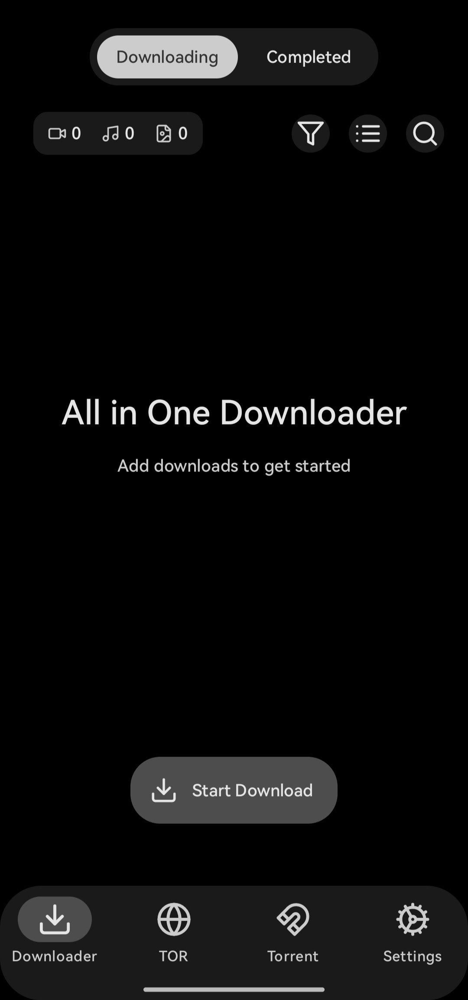
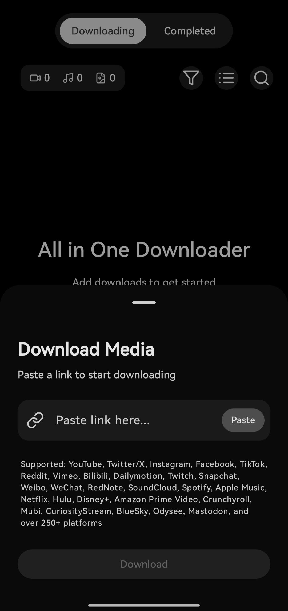
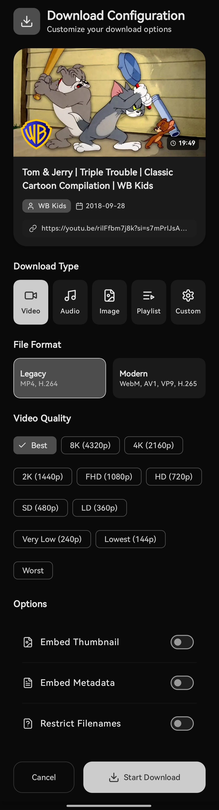
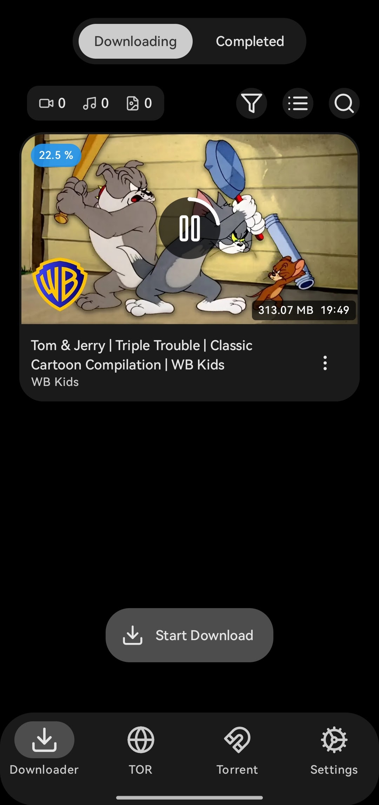
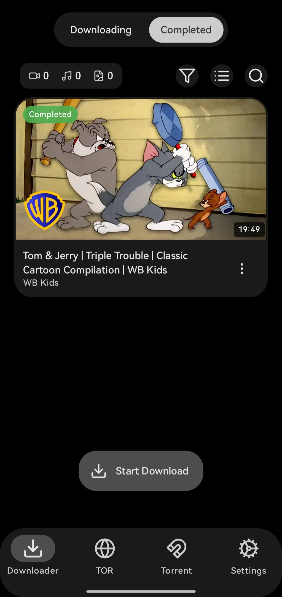
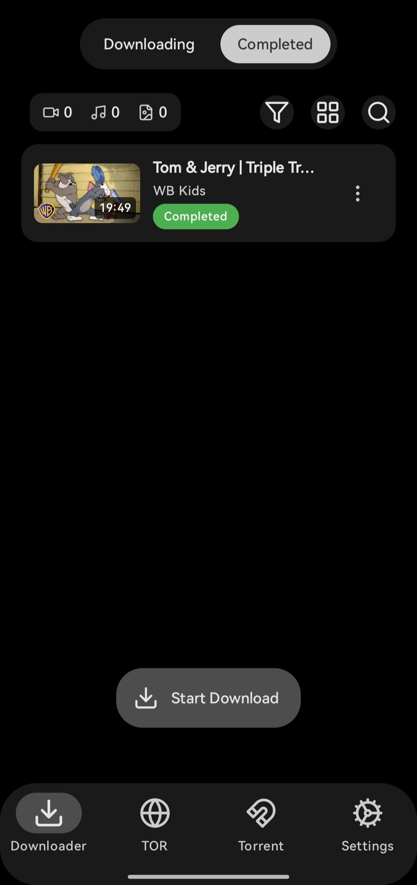
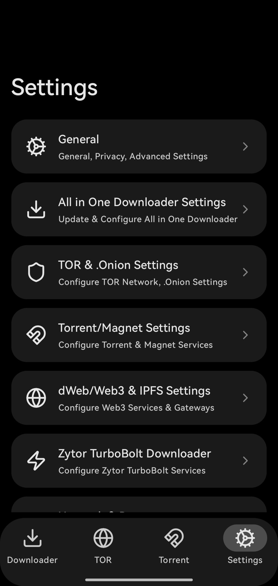
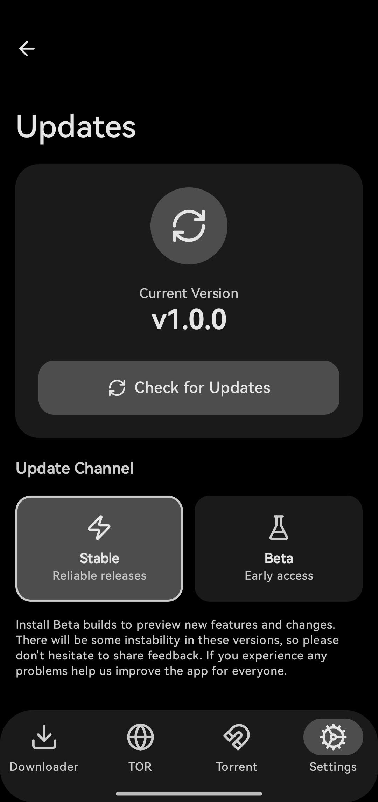

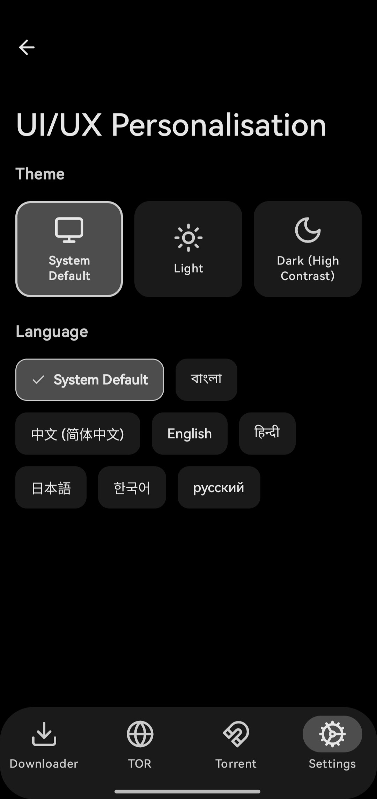
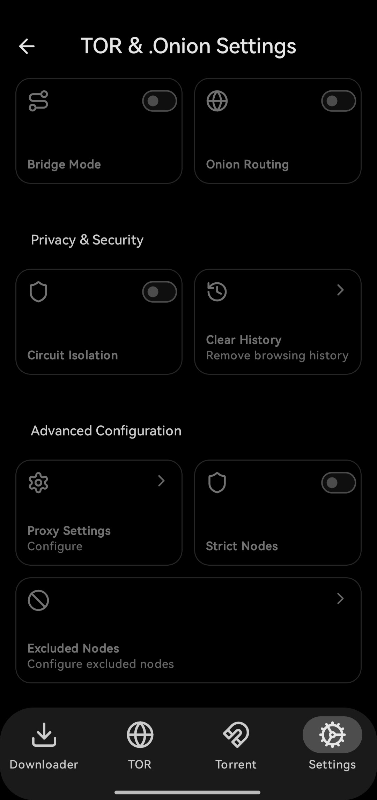

## Features

### 🎥 Ultimate Video Downloader

**Resolutions:** `8K • 4K • 2K • 1080p • 720p • 480p • 360p • 240p • 144p`

**Formats:** `MP4 • WebM • MOV • MKV`

**Codecs:** `H.264 • H.265 (HEVC) • VP9 • AV1`

**Smart features:**  

- Auto-merge video + audio  
- Clean filename handling  
- Optional metadata & thumbnail embedding  

No tricks. No watermarks. No compression surprises.

### 🎧 Ultimate Audio Downloader

**Formats:** `M4A • Opus • MP3`  

**Qualities:** `Best • 192k • 128k • 64k • 32k • Lowest`

Perfect for:  
Music • Podcasts • Lectures • DJ mixes • Motivation videos

### 🖼️ Ultimate Image Downloader

Zytor goes beyond videos & audio.

**Formats:** `JPEG • PNG • WebP • Original`

**Qualities:** `Original • 2K • 1080p • 720p • Thumbnail`

Images, thumbnails, posters, reels, covers —  
**If it’s visual, Zytor downloads it.**

### 🌍 Supported Platforms

**Zytor works almost everywhere.**  
Paste a link. Press download. Done.

**Supported:** YouTube, Twitter/X, Instagram, Facebook, TikTok, Reddit, Vimeo, Bilibili, Dailymotion, Twitch, Snapchat, Weibo, WeChat, RedNote, SoundCloud, Spotify, Apple Music, Netflix, Hulu, Disney+, Amazon Prime Video, Crunchyroll, Mubi, CuriosityStream, BlueSky, Odysee, Mastadon — **and over 250+ platforms.**

### ⚡ Five Modes. Infinite Control

| Mode         | What It Does |
|--------------|-------------|
| **Video**    | Full Video|
| **Audio**    | Only Sound |
| **Image**    | Download images, covers & thumbnails |
| **Playlist** | Grab entire collections at once |
| **Custom**   | Control exact formats, codecs, bitrates & more |

Beginners get simplicity.  
Power users get superpowers.

### 📊 Built-In Download Manager

- Task queue for all downloads  
- Real-time speed, ETA & size  
- Pause / resume / retry  
- Full history with thumbnails  
- Switch between **Grid** and **List** layouts  

This isn’t a downloader.  
It’s a **media control center**.

### 🎨 Modern, Beautiful, Fast

- Premium UI  
- True dark mode  
- Smooth, fluid animations  
- No ads. No trackers. No clutter. Full Privacy.

### 🏛 Under the Hood (For Developers)

A meticulously crafted, scalable architecture:

- Kotlin
- Jetpack Compose
- Multi-module system
- High-performance storage

**Engineered — not patched together.**

## 🗺 Roadmap

| Feature                     | Status |
|----------------------------|:------:|
| All-in-One Downloader      |   ✅   |
| TOR Integration    |  🚧 Coming Soon |
| Torrent Support            |  🚧 Coming Soon |

Zytor is not finished. It’s evolving.

## ✨ Why Zytor Exists

There are thousands of so-called downloaders —  but each one does **only one thing**:

❌ One app for YouTube  
❌ One site for MP3  
❌ One app for Instagram images  
❌ One app full of ads  
❌ One tool that breaks every month  

**Zytor ends this nonsense.**  
It is the **first downloader built like a real product — not a trick/hack.**

## 💥 What Makes Zytor Different?

| Feature                     | Zytor | Others |
|----------------------------|:----:|:-----:|
| Video Downloads            |  ✅   |   ✅   |
| Audio Downloads            |  ✅   | ⚠️    |
| Image Downloads            |  ✅   |  ❌    |
| All Resolutions (8K → 144p)|  ✅   | ⚠️    |
| Multiple Formats/Codecs    |  ✅   |  ❌    |
| Playlist Support           |  ✅   | ⚠️    |
| Modern UI                  |  ✅   |  ❌    |
| No Ads. No Tracking. Full Privacy |  ✅   |  ❌    |
| Fully Customizable         |  ✅   |  ❌    |

Zytor isn’t competing with downloaders — **it replaces the entire category.**

## 🔖 Release Types

Zytor uses two release channels:

- **Stable** — Recommended for everyone. Fully tested.  
  *(Example: `v1.0.0`)*

- **Beta** — Experimental features. May contain bugs.  
  *(Example: `v1.5.0-beta`)*

## ❤️ Support the Project

If Zytor replaced 5 different apps on your phone — give it a ⭐. It helps more than you think.

**Designed & Developed with 🩷 by @ImKKingshuk**

